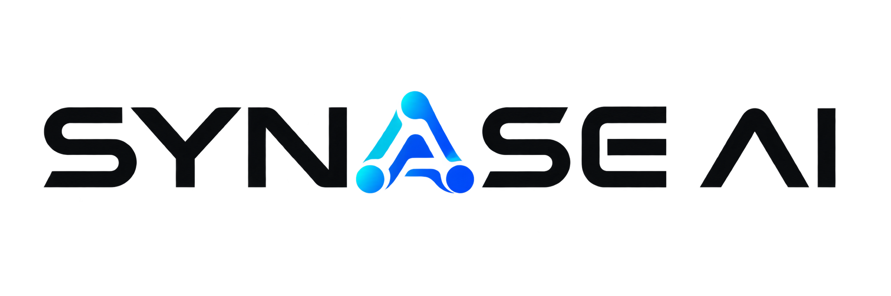

<p align="center">
  
</p>

<h1 align="center">SYNASE AI</h1>

<p align="center">
  <strong>Autonomous Decision-Intelligence Console for Software & Product Engineering</strong>
</p>

<p align="center">
  <a href="https://github.com/satyam022028singh/Synase-ai/actions"></a>
  <a href="https://github.com/satyam022028singh/Synase-ai"></a>
  <a href="https://github.com/satyam022028singh/Synase-ai"></a>
  <a href="https://github.com/satyam022028singh/Synase-ai"></a>
  <a href="https://github.com/satyam022028singh/Synase-ai"></a>
  <a href="https://github.com/satyam022028singh/Synase-ai"></a>
</p>

---

## Executive Overview

**SYNASE AI** is an enterprise AI decision-intelligence platform engineered for software teams, product managers, and engineering leaders. Unlike open-ended conversational chatbots or passive database viewers, SYNASE AI bridges multimodal artifacts, git repository source trees, MCP runtime telemetry, and corporate product strategy into **reviewable, audit-grade engineering decisions**.

The platform is designed around strict deterministic provenance, verifiable evidence citations, human-in-the-loop approvals, and a zero-runtime-dependency vanilla ES module architecture.

```text
 ┌────────────────────────────────────────────────────────────────────────┐
 │                              SYNASE AI                                 │
 │                 Enterprise Decision-Intelligence Mesh                  │
 └───────────────────────────────────┬────────────────────────────────────┘
                                     │
         ┌───────────────────────────┴───────────────────────────┐
         ▼                                                       ▼
 ┌───────────────────────────────┐               ┌───────────────────────────────┐
 │   PRODUCT INTELLIGENCE        │               │     DEVOPS INTELLIGENCE       │
 ├───────────────────────────────┤               ├───────────────────────────────┤
 │ • Executive Overview Bento    │               │ • Repository Understanding    │
 │ • Requirements & Import       │               │ • Architecture Review         │
 │ • Multi-Factor Prioritization │               │ • Code Quality & Findings     │
 │ • Strategic Intent & Tenets   │               │ • Security & Vulnerabilities  │
 │ • Milestone Roadmap Sequence  │               │ • Dependency Health & Risks   │
 │ • Audited Decision Trace Logs │               │ • CI/CD Deployment Plans      │
 └───────────────┬───────────────┘               └───────────────┬───────────────┘
                 │                                               │
                 └───────────────────────┬───────────────────────┘
                                         ▼
                 ┌───────────────────────────────────────────────┐
                 │           CENTRAL ORCHESTRATION               │
                 ├───────────────────────────────────────────────┤
                 │ • Model Context Protocol (MCP V2) Runtime     │
                 │ • Deterministic Knowledge Graph (Neo4j / Mem) │
                 │ • Vector Memory & Semantic Search (ChromaDB)  │
                 │ • Human-in-the-Loop Decision & Approvals      │
                 └───────────────────────────────────────────────┘
```

---

## Core Value Pillars & Invariants

1. **Deterministic Provenance Separation (Invariant 14)**  
   Every item presented across the console explicitly declares its origin: **`confirmed`** (verified human truth) versus **`ai_suggested`** (model generated). AI suggestions display an interactive confidence meter (0–100%) and grounded rationale.
2. **Non-Execution Semantics (Invariant 22)**  
   No model suggestion, proposal, or approval silently mutates live codebases or initiates CI/CD deployment runs. Approvals record human intent; execution boundaries remain guarded and explicit.
3. **Strict Mutation Idempotency (Invariant 08)**  
   All mutating API operations require an `Idempotency-Key` header with in-memory deterministic replay caching, preventing duplicate mutations across network retries.
4. **Recursive Credential Redaction (Invariant 19)**  
   All tokens, API keys, cookies, authorization headers, and secrets are recursively stripped before entering browser stores, audit projections, or event streams.
5. **Zero External Runtime Dependencies**  
   Built purely with standards-compliant HTML5, CSS3, and modern vanilla ES modules. Fast first paint, zero bundler complexity, zero supply-chain vulnerabilities, and instant containerization.

---

## Intelligence Layers & Core Capabilities

### 1. Product Intelligence Layer (Phase 7 Revamp)
A dedicated, project-scoped decision workspace designed for Product Leads and Engineering Directors:
* **Executive Overview Bento**: High-density metric widgets displaying requirement verification ratios, active strategic objectives, top-ranked candidate features, upcoming roadmap milestones, and audited decisions.
* **Requirements Inventory**: Tabular requirement tracking with live search, multi-field filtering (`Status`, `Priority`, `Provenance`), and an interactive **Inspection Drawer** displaying architectural impact, rationale, and live lifecycle status transitions.
* **Bulk Import Modal**: Import structured requirements via JSON arrays or newline-delimited specifications with schema validation.
* **Multi-Factor Prioritization Matrix**: Dynamic candidate feature cards scored across four calibrated dimensions:
  $$\text{Score} = \frac{\text{Business Value} + \text{Customer Impact}}{\text{Implementation Effort} + \text{Architectural Risk}}$$
  Features support manual rank shifting (▲/▼), candidate deletion, and **Auto-Rank by Value/Effort** optimization.
* **Strategic Intent & Tenets**: Visualized core objectives, numbered engineering principles, known failure modes & mitigations, and operational alignment gauges.
* **Milestone Delivery Roadmap**: Sequenced delivery schedule with topological dependencies, release versioning, start/end dates, linked feature cards, and sequence reordering.
* **Audited Decision Trace Log**: Full provenance trail with author identification, timestamping, impact scoping, and cited repository evidence.

### 2. Autonomous Chat & Work Studio
A versatile post-login decision environment (`/app/chat` and `/app/dashboard`):
* **Contextual Composer**: Intelligent composer supporting 5 specialized **Agent Modes**:
  * 🎥 `Video` — Screen capture and visual workflow analysis.
  * 🖼️ `Image` — Wireframe, UI mockup, and architecture diagram ingestion.
  * 🌐 `Web Search` — Realtime external documentation and benchmark grounding.
  * 💻 `Code` — Repository AST parsing and syntax understanding.
  * 📝 `Text` — Natural language synthesis and decision documentation.
* **Intelligence Layer Targeting**: Explicit targeting chips for `Product` vs `DevOps`.
* **Cognitive Effort Calibration**: Granular effort levels (`Auto`, `Low`, `Medium`, `High`, `Max`) controlling analysis depth and reasoning passes.

### 3. DevOps Intelligence Layer
Automated repository health, architectural evaluation, and deployment governance:
* **Architecture Review**: Module boundaries, cyclic dependency analysis, and structural propagation cost.
* **Code Findings & Vulnerabilities**: Security findings graded by severity (`critical`, `high`, `medium`, `low`) with source file anchors.
* **Dependency Health**: License compatibility, version drift, and dependency CVE vulnerability tracking.
* **Test Plan Generation**: Seams and coverage gap analysis producing actionable test suggestions.
* **Deployment Plans**: Phased release plans with multi-step validation checks and gate approvals.

### 4. MCP V2 Runtime & Observability
Full Model Context Protocol (MCP) server lifecycle inspection:
* Active server discovery, directory mapping, model inventory, and tool registration.
* Granular stage tracing (`received` → `parsed` → `tool_lookup` → `executed` → `redacted` → `completed`).
* Live mock health checks and idempotent tool discovery.

### 5. Knowledge Graph & Vector Memory
* **Context Explorer**: Unified project context items categorized by sensitivity and trust tiers.
* **ChromaDB Semantic Projection**: Ranked memory search over project context with relevance scoring.
* **Neo4j Graph Topology**: Projected relationship graphs linking requirements, features, repositories, and architectural modules.

### 6. Settings Control Plane (16 Canonical Domains)
Centralized configuration management engine with deterministic scope cascading:
* **Scope Precedence & Policy Locks**: `system > workspace > project > agent > task > session > user` with cryptographic policy locks that prevent unauthorized overrides.
* **16 Canonical Domains**:
  1. `General`: Profile attributes, timezone, email notifications
  2. `Workspace & Members`: Organization identity, team members, roles, guest access
  3. `Appearance & Accessibility`: Google Antigravity dark/light theme, density, reduced motion
  4. `AI & Models`: Foundation models, temperature determinism, provider fallback, status table
  5. `Agents & Autonomy`: Autonomy tiers (Assisted / Supervised / Autonomous), confirmation policy, chain limits
  6. `Tools & Permissions`: Granular RBAC permissions for terminal shell, file mutation, MCP tools
  7. `Memory & Context`: ChromaDB vector memory, retention windows, auto-compaction threshold
  8. `Vault & Knowledge`: Document chunk window length, automated knowledge re-indexing
  9. `API & Developer`: Invariant 19 compliant key management (one-time secret modal), wire tracing
  10. `Automations`: Parallel task concurrency limits, halt-on-error policy, scheduled background jobs
  11. `Usage & Limits`: Token consumption quotas, monthly cap ceilings, budget alert thresholds
  12. `Security & Privacy`: Mandatory MFA enforcement, session idle timeouts, cryptographic audit integration
  13. `Connectors`: OAuth 2.0 telemetry sources (GitHub, Jira, Linear, Slack)
  14. `Messaging`: Notification channels, webhook broadcasting, quiet hours policy
  15. `Data & Import/Export`: JSON snapshot backup export, schema validation & import preview, PII anonymization
  16. `Advanced`: Experimental capability previews, diagnostic telemetry opt-in, Danger Zone factory reset
* **Invariant 19 Credential Security**: One-time secret reveals; only masked prefixes (`syn_live_...`) are stored in persistent state.

---

## System Architecture

SYNASE AI strictly adheres to an unidirectional **3-Layer Architecture**:

```text
src/
├── app/                  # Composition Root (Shell, Router, Delegated Event Listener)
│   ├── main.js           # Hydration, route data loader, single listener for click/input/submit
│   ├── router.js         # Central route matcher & page renderer
│   ├── shell.js          # Global sidebar, topbar, workspace/project switchers, toast
│   ├── paths.js          # Authoritative route table, active route helpers, navigate()
│   ├── auth.js           # Full-page split login, registration, password recovery
│   └── actions/work.js   # Chat & Work controller
│
├── [domains]/            # Domain Modules (Isolated; never import sibling domains)
│   ├── home/             # Landing overview, workspace management, repository inputs
│   ├── product/          # Product intelligence views, components, modals, and API facade
│   ├── devops/           # DevOps intelligence views, findings, test suggestions, and API
│   ├── mcp/              # MCP V2 runtime observability, discovery, and trace views
│   ├── settings/         # Settings control plane views, components, modals, engine, and API facade
│   ├── context/          # Context explorer, semantic memory, and knowledge graph views
│   ├── outputs/          # Decision reports, export pipeline, and human-in-the-loop approvals
│   ├── integrations/     # Provider connections, synchronization runs, and immutable audit
│   └── work/             # Standalone chat studio, composer, and agent mode controls
│
└── shared/               # Leaf Layer (Pure primitives; imports nothing outside itself)
    ├── api/              # Authoritative mock database (db.js), mock adapter, error types
    ├── state/            # Reactive state store, search param helpers, reset actions
    ├── components/       # Escaped UI helpers, status tags, badges, provenance cards
    ├── services/         # Theme service (Dark / Light), session management
    ├── utils/            # format.js (escapeHtml), date utilities, string helpers
    └── types/            # TypeScript domain declarations (types.d.ts)
```

### Architectural Invariants
* **No Cross-Domain Imports**: A domain (`product/`, `devops/`, `mcp/`) must never import from another domain. Cross-domain data passes through `shared/` or is coordinated by `app/main.js`.
* **Zero Listener Attachment in Views**: Views are pure functions returning escaped HTML strings. User intent is declared strictly via HTML attributes:
  * `data-route="/app/..."` — Client-side route transition.
  * `data-action="..."` — Handled centrally in `app/main.js`.
* **Single Composition Root**: All DOM event handling (clicks, inputs, changes, submissions) is delegated through `src/app/main.js`.

---

## Antigravity Design System

SYNASE AI features a bespoke, high-contrast user interface styled after the **Google Antigravity** visual palette:

* **Sharp Square Geometry**: Containers, cards, buttons, badges, and modals enforce sharp, architectural square geometry (`border-radius: 0`) to eliminate generic AI aesthetic tropes.
* **Calibrated Semantic Tokens**:
  ```css
  --g-10: #121317;           /* Deep Obsidian Background */
  --surface: #1e1f24;        /* Card & Drawer Surface */
  --surface-alt: #282a30;    /* Elevated Surfaces & Tables */
  --border: #2e3138;         /* Subtle Wireframe Borders */
  --border-strong: #45474d;  /* Interactive Element Borders */
  --accent: #3279f9;         /* Antigravity Blue Accent */
  --accent-hover: #1557b0;   /* Deep Cobalt Interaction */
  ```
* **No Raw Colors**: All colors flow through semantic CSS variables with full automatic Dark / Light mode adaptation and zero flash-of-unstyled-content (FOUC).

---

## API Surface (103 Canonical Endpoints)

The platform implements an enterprise RESTful specification documented in [`ALL_APIs.TXT`](./ALL_APIs.TXT):

### Standard Response Envelopes

**Resource Envelope:**
```json
{
  "data": {
    "id": "REQ-001",
    "title": "Audit trail encryption at rest",
    "provenance": "confirmed",
    "status": "approved"
  },
  "meta": {
    "requestId": "req_01j9a82b3c4d5e"
  }
}
```

**Paginated Collection Envelope:**
```json
{
  "data": [ ... ],
  "meta": {
    "page": 1,
    "pageSize": 25,
    "total": 142,
    "requestId": "req_01j9a82b3c4d5e"
  }
}
```

**Normalized Error Contract (`ApiError`):**
```json
{
  "error": {
    "code": "IDEMPOTENCY_REQUIRED",
    "message": "An idempotency key is required for mutating operations.",
    "status": 400,
    "requestId": "req_01j9a82b3c4d5e",
    "details": {}
  }
}
```

### Key API Categories

| Section | Route Range | Description |
| :--- | :--- | :--- |
| **Auth & Session** | `API-01` – `API-03` | User sign-in, account registration, password recovery. |
| **Workspace & Projects** | `API-04` – `API-13` | Multi-tenant workspaces, membership, project CRUD, repos. |
| **Assets & Ingestion** | `API-14` – `API-23` | Multimodal uploads, OCR, AST parsing, preview generation. |
| **Analysis & Workflows** | `API-30` – `API-38` | Orchestrator analysis requests, task DAGs, live SSE stream. |
| **MCP V2 Runtime** | `API-39` – `API-47` | Server discovery, model catalogs, tools, trace execution. |
| **Product Intelligence** | `API-48` – `API-52`, `API-88` – `API-103` | Requirements lifecycle, scoring matrix, strategy, roadmap. |
| **DevOps Intelligence** | `API-53` – `API-59` | Code findings, vulnerability scans, CI/CD deployment plans. |
| **Context & Graph** | `API-60` – `API-64` | Memory vector search, retrieval history, Neo4j projections. |
| **Reports & Approvals** | `API-65` – `API-74` | Executive decision dossiers, publishing, gate approvals. |
| **Integrations & Audit** | `API-75` – `API-85` | Connectors (GitHub, Jira, Linear), sync runs, audit trail. |
| **Decision Dashboard** | `API-86` – `API-87` | System-wide readiness score and executive attention queue. |

---

## Getting Started

### Prerequisites
* **Node.js**: `v20.0.0` or higher (built and verified on Node `v24`).
* **Package Manager**: `npm` (ships with Node.js).
* **Zero npm install required**: The runtime has **zero external dependencies**.

### Quick Start (Local Development)

```bash
# 1. Clone repository
git clone https://github.com/satyam022028singh/Synase-ai.git
cd Synase-ai

# 2. Run unit and contract tests (76 passing tests)
npm test

# 3. Build production distribution (dist/ bundle)
npm run build

# 4. Start local development server
npm run dev
```

Visit [`http://localhost:4173`](http://localhost:4173) in your browser.

### Key NPM Scripts

| Command | Action |
| :--- | :--- |
| `npm test` | Executes the complete Node.js test suite across all domains via `node --test test/*.test.mjs`. |
| `npm run build` | Generates 42 clean static production assets into `dist/` with SHA-256 hashes and build manifest. |
| `npm run dev` | Boots the local static development server at `http://127.0.0.1:4173/`. |
| `npm run brain` | Extracts code facts and compiles the project knowledge graph (`brain/graph.json`). |
| `npm run brain:query` | Runs the interactive CLI query engine against the project's knowledge graph. |

---

## Route Matrix

Navigation uses fast hash-based routing (`#/route`), enabling seamless operation on any static web server, CDN, or object storage bucket:

| Hash Route | Target Surface | Responsibility |
| :--- | :--- | :--- |
| `#/` or `landing.html` | Marketing Landing | Enterprise product showcase, feature bento, and live pipeline demo. |
| `#/auth/login` | Authentication | Split-screen enterprise login with demo bypass. |
| `#/app/chat` | Autonomous Studio | Focused agent composer (Video/Image/Search/Code/Text modes). |
| `#/app/dashboard` | Decision Console | Executive workspace overview and readiness dashboard. |
| `#/app/intelligence/product` | Product Console | Master Product Intelligence root (defaults to Overview). |
| `#/app/intelligence/product/overview` | Product Overview | Executive metrics, top features, roadmap summary, recent decisions. |
| `#/app/intelligence/product/requirements` | Requirements | Searchable inventory, multi-filters, detail drawer, import modal. |
| `#/app/intelligence/product/prioritization` | Prioritization | 4-dimension scoring matrix (Value/Impact/Effort/Risk), auto-rank. |
| `#/app/intelligence/product/strategy` | Strategy & Tenets | Objective hero card, guiding principles, known operational risks. |
| `#/app/intelligence/product/roadmap` | Milestone Roadmap | Sequenced release milestones, topological dependencies. |
| `#/app/intelligence/product/decisions` | Decision Trace | Immutable decision history with evidence grounding. |
| `#/app/intelligence/devops` | DevOps Console | Repository architecture, code quality, security findings. |
| `#/app/mcp/overview` | MCP V2 Runtime | Model Context Protocol servers, tools, and execution traces. |
| `#/app/context/overview` | Context & Memory | Project memory search, retrieval history, knowledge graph. |
| `#/app/reports` | Decision Reports | Generated executive dossiers, exports, and publication gates. |
| `#/app/approvals` | Human Approvals | Gate approvals for architecture, security, and releases. |
| `#/app/integrations` | Integrations & Audit | Third-party connections, sync health, and immutable audit logs. |

---

## Machine Knowledge Base (Brain System)

SYNASE AI features a self-documenting, machine-readable knowledge base located in `brain/`:

* **`brain/graph.json`**: Authoritative knowledge graph containing **381 entities** and **789 semantic relationships** spanning:
  * Application routes, UI components, and domain API facades.
  * Architectural invariants (e.g. `Invariant 08: Idempotency`, `Invariant 14: Provenance`).
  * Database entities and project-scoping boundaries.
* **`brain/facts.json`**: Low-level AST telemetry covering 69 source files, 76 automated test specs, and 12 architecture layers.
* **`brain/product/`**: Domain schemas for Product Intelligence nodes, edges, taxonomy, and validation invariants.

Query the graph interactively at any time:
```bash
node scripts/brain-query.mjs "What are the invariants of the Product layer?"
```

---

## Repository Structure

```text
.
├── .github/workflows/          # CI/CD validation workflows
├── brain/                      # Machine knowledge graph (graph.json, facts.json, schemas)
│   └── product/                # Product intelligence schemas & invariants
├── dist/                       # Production bundle (42 assets + manifest)
├── docs/                       # Specifications and engineering handbooks
│   └── product/                # PRD, BRD, Architecture, API contract, and plans
├── LOGO/                       # Penrose impossible-triangle brand assets
├── scripts/                    # Dependency-free tooling (build, serve, brain extract)
├── src/
│   ├── app/                    # Composition root (main.js, router.js, shell.js)
│   ├── assets/                 # SVGs, web icons, branding logos
│   ├── context/                # Context & Memory domain
│   ├── devops/                 # DevOps Intelligence domain
│   ├── home/                   # Landing, workspace, and dashboard domains
│   ├── integrations/           # Third-party integrations & audit domain
│   ├── mcp/                    # Model Context Protocol V2 domain
│   ├── outputs/                # Reports & Approvals domain
│   ├── product/                # Product Intelligence domain
│   │   ├── api/index.js        # Product API facade & factory
│   │   ├── components/         # Intelligence header, provenance badges, modals
│   │   ├── pages/              # Overview, requirements, prioritization, strategy, roadmap, decisions
│   │   └── types.d.ts          # Product domain type declarations
│   ├── shared/                 # Leaf utilities, mock database, state store, UI components
│   ├── styles/                 # Scoped stylesheets & Antigravity tokens
│   └── work/                   # Chat & Work standalone composer surface
├── test/                       # node:test contract and lifecycle test suites
├── ALL_APIs.TXT                # Complete catalog of 103 REST API endpoints
├── ARCHITECTURE.md             # In-depth architectural rules and patterns
├── context(progress till now).txt # Comprehensive project progress ledger
├── index.html                  # Root static redirect
├── landing.html                # Enterprise marketing landing page
├── app.html                    # Console single-page entry
└── package.json                # Project manifest and scripts
```

---

## Testing & Quality Assurance

The codebase includes an exhaustive contract verification suite covering all domain facades, idempotency guarantees, provenance assertions, and HTML rendering:

```bash
$ npm test

✔ list response uses the documented envelope (227ms)
✔ project creation requires idempotency (526ms)
✔ repositories remain project scoped (457ms)
✔ upload initiation requires idempotency (1075ms)
✔ MCP trace stages remain ordered (232ms)
✔ requirements preserve confirmed and AI-suggested provenance (233ms)
✔ feature prioritization remains ordered by rank (234ms)
✔ roadmap dependencies reference earlier milestones (232ms)
✔ Product API lists requirements with canonical envelope (230ms)
✔ Product mutations require an idempotency key (Invariant 08) (1935ms)
✔ Requirement lifecycle: create, get, update, and idempotent replay (935ms)
✔ AI-proposed requirements have distinct provenance and confidence (233ms)
✔ Product Features: multi-criteria scoring and rank re-ordering (462ms)
✔ Product Strategy: get and update persistence (498ms)
✔ Roadmap milestones: create, list, and delete (640ms)
✔ Product decisions and overview projection (465ms)
✔ Domain API factory produces independent instance (233ms)
✔ Product page views render valid HTML without exceptions (252ms)
✔ Feature deletion and requirement import lifecycle (916ms)
✔ Roadmap resequencing and intelligence analysis actions (1771ms)

ℹ tests 76
ℹ pass 76
ℹ fail 0
```

---

## License & Ownership

Copyright © 2026 **SYNASE AI**. All rights reserved.  
Proprietary software. Unauthorized reproduction, distribution, or decompilation is strictly prohibited.
